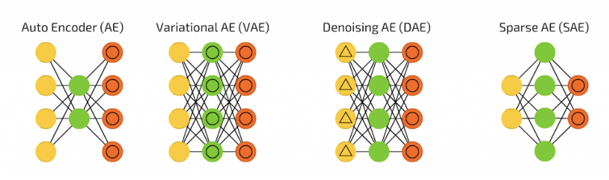
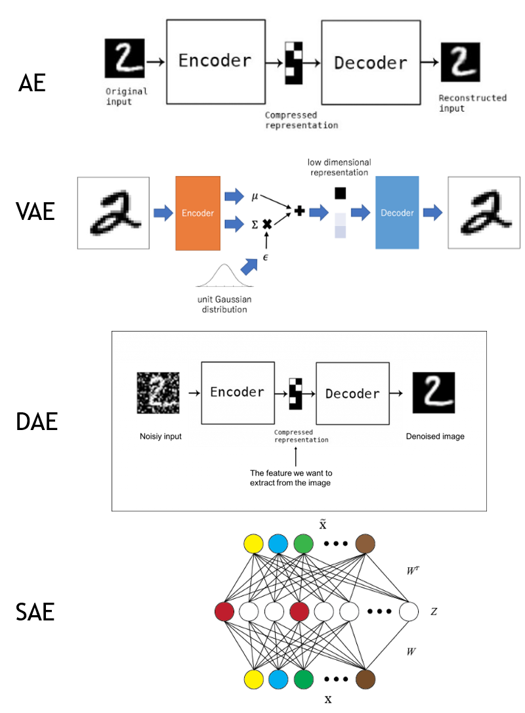
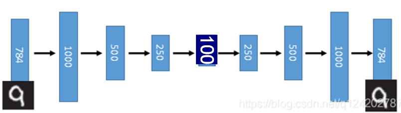
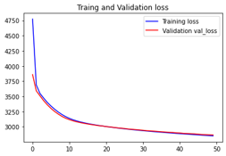
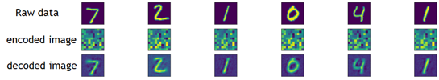
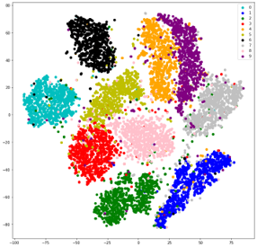

# auto-encoder
使用python3.8練習auto encoder
## auto-encoder介紹
* 特性:

  資料的壓縮演算法，其中資料的壓縮和解壓縮函式是資料相關的、有損的、從樣本中自動學習的。

* 概念:

  主要分為以下四種
  
  
  
  * AE: Encoder（編碼器）和 Decoder（解碼器）兩部分，它們分別做壓縮與解壓縮的動作，讓輸出值和輸入值表示相同意義
  
  * VAE: 與AE不同之處，在編碼過程增加了一些限制，迫使生成的向量遵從高斯分佈，因此 VAE 理論上是可以讓你控制要生成的圖片

  * DAE: 是一種學習對圖片去噪（denoise）的神經網絡，它可用於從類似圖像中提取特徵到訓練集，實際做法是在 input 加入隨機 noise，然後使它回復到原始無噪聲的資料，使模型學會去噪的能力。
  
  * SAE: 的作法是在 AutoEncoder 基礎上加上 L1 正則化，限制每次得到的 representation 盡量稀疏，迫使自動編碼器將每個輸入表示為少量節點的組合，只有一小部分節點具有非零值，稱為活動節點。為什麼要盡量稀疏呢？事實上在特徵稀疏的過程裡可以過濾掉無用的訊息，每個神經元都會訓練成辨識某些特定輸入的專家，因此 Sparse AE 可以給出比原始資料更好的特徵描述。

  以下為四種方法的詳細作法
  
    

## 程式碼:

  * 輸入:
    > mnist = datasets.mnist
    
    > (x0, y0), (x1, y1) = datasets.mnist.load_data()
    
    > train_x = x0.reshape(-1,784)
    
    > train_y = x0.reshape(-1,784)
    
    > test_x = x1.reshape(-1,784)
    
    > test_y = x1.reshape(-1,784)
    
    使用keras的mnist手寫數字
    
  * auto-encoder model:
  
    > input_x = Input([784,])

    > #encoder
    
    > enc_input = Input([784,])
    
    > x = Dense(1000,activation= 'relu')(input_x)
    
    > x = Dense(500,activation= 'relu')(x) 
    
    > x = Dense(250,activation= 'relu')(x) 
    
    > enc_output = Dense(100)(x) 
    
    > encoder = Model(input_x,enc_output)
    
    > #decoder
    
    > dec_input = Input([100,])
    
    > x = Dense(250,activation= 'relu')(dec_input) 
    
    > x = Dense(500,activation= 'relu')(x) 
    
    > x = Dense(1000,activation= 'relu')(x) 
    
    > x = Dense(784)(x) 
    
    > dec_output = x
    
    > decoder = Model(dec_input,dec_output)
    
    > #合并
    
    > code = encoder(input_x )
    
    > output = decoder(code)

    > model = Model(input_x,output)

    > optimizer = optimizers.Adam(0.00001)
    
    > model.compile(optimizer=optimizer,loss='mse')
    
    > early_stopping=tf.keras.callbacks.EarlyStopping(monitor='val_loss', min_delta=1,patience=5, verbose=0, mode='auto',baseline=None, restore_best_weights=False)
    
    > history = model.fit(train_x,train_y,validation_data = (test_x,test_y),batch_size =128,epochs =10,callbacks = [early_stopping])
    
    架構如下圖
    
      
  
* 成果: 
  * Traing and Validation loss:
  
     
   
  * raw data、encoded image、decoded image比較:
  
     
   
  * T-sne 後的decoded image(二維):
  
     
